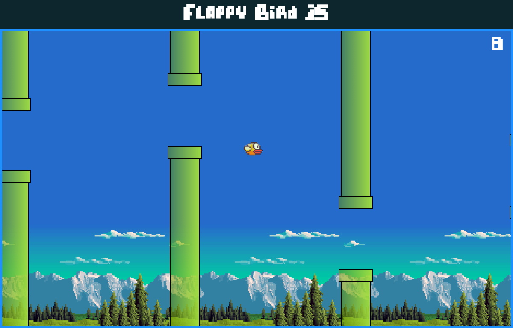

# Flappy Bird JS

A simple Flappy Bird game developed with HTML, CSS and JavaScript.

Developed using:
* HTML 5
* CSS 3
* JavaScript

No plugins, no libraries. Just Vanilla JS. 

[Live demo](http://nathanssantos.github.io/flappy-bird-js)

## Usage instructions

[Download the project](https://github.com/nathanssantos/flappy-bird-javascript/archive/master.zip) and open `index.html` on your browser.

Press any key on the keyborad to make the bird fly.
Refresh the page to restart the game (not finished yet).

## To do

* Game menu
* Game over modal with the player's points and a restart function
* Difficulty menu with barriers gap and speed selection

## Authors

Nathan S. Santos - [LinkedIn](https://www.linkedin.com/in/nathan-s-santos-4b2637163/) / [GitHub](https://github.com/nathanssantos) 

## License

This project is licensed under the MIT License - see [LICENSE.md](LICENSE.md) for details.
